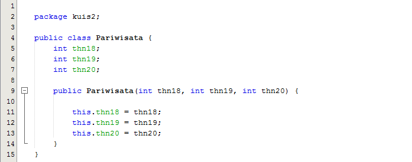

LAPORAN KUIS

Class Node memiliki 2 attribut, data dan next. Attribute data bertipedata int,
jadi linked list yang dibuat akan digunakan untuk mengelola data int.
Attribute next bertipe Node, Artinya attribute next akan diisi dengan objek
dari Node. Atribut next ini yang berperan sebagai pointer/link.

Kelas Pariwisata ini berfungsi untuk mengelola data int dimana terdapat 3 atrbut yaitu thn18 yang nantinya akan diisi oleh data di tahun 2018, thn19 yang nantinya akan diisi oleh data di tahun 2019, dan thn20 yang nantinya akan diisi oleh data di tahun 2019

Kelas LinkedList

Kelas Main

Output

