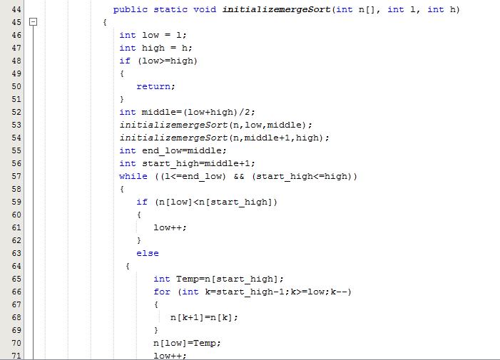

# Laporan UTS

Penjelasan

Binary Seacrh adalah pencarian nilai yang inputkan. Nilai tersebut disimpan didamaln atribut nilai dengan tipe data double karena ipk yang akan dicari memiliki angka dibelaknga koma.yang akan dikembalikan untuk metod ini adalah nilai x. ada tidaknya nilai x akan dicari di method ini. apabila angka yang dicari tidak ditemukan maka akan dikembalikan -1, yang isinya adalah  "Tidak diteukan mahasiswa dengan IPK :". Didalam method ini terdapat banyak kondisi terhadap posisi elemen. Yang pertama adalah apabila elemen berada di tengah maka maka yang akan dilakukan adalah  

int mid = l + (r - l)/2;

Apabila elemen lebih kecil dari nilai tengah maka

return binarySearch(arr, l, mid-1, x);

Dan ketika tidak ada elem yang ditemukan maka yang dilakukan adalah -1

Sedangkan untuk method MergeSort adalah pengurutan data dengan menggukanan Rekursif.
Proses yang dilakukan pertama adalah pengurutan dari index pertama sampai indexTengah. ambil nilai arraynya mulai dr index ke i sampai ke indexTitikTengahArray kemudian bandingkan hasilnya dengan nilai pada indexTitikTengahArray + 1 hingga ke indexAkhirArray.Karena default datanya adalah ascending,maka kalau sebelah kiri lebih kecil berarti yang lebih dulu masuk. Jika lebih besar, nilai array bagian kanan yg masuk ke array akhir, kemudian index naik. Kemudian lanjut ke index berikutnya sampai titik tengah. Kemudian akan dilakukan dilakukan sampai akhirnya pada return

